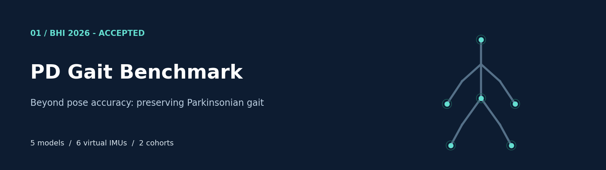
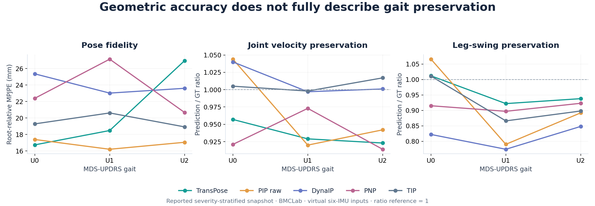
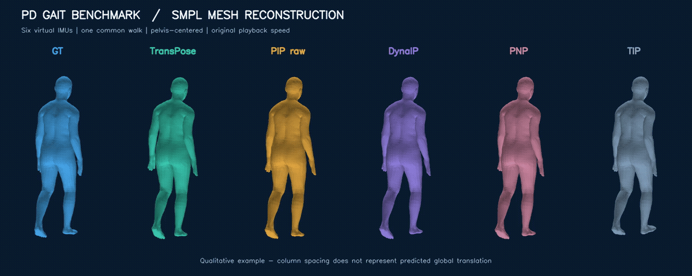
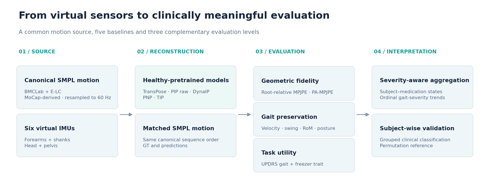

<div align="center">



# PD Gait Benchmark
**Do accurate poses preserve Parkinsonian gait?**


[Research question](#research-question) · [Results](#what-the-benchmark-reveals) · [Video](#motion-comparison) · [Reproduce](#get-started) · [Follow-up study](https://github.com/nicoyoung1101/pd-aware-finetuning)

</div>

## Research question
Sparse inertial pose estimation can produce plausible motion while changing the gait characteristics that matter in Parkinson's disease. This project evaluates **reconstruction fidelity, gait-feature preservation and downstream clinical utility** together, comparing five healthy-pretrained models on MoCap-derived virtual IMUs.

| Dataset | Role | Scale |
|---|---|---|
| CARE-PD / BMCLab | Severity-stratified reconstruction and gait preservation | 23 participants · 781 walks |
| E-LC | Subject-level freezer-trait classification | 53 participants |

**Models:** TransPose · PIP raw · DynaIP · PNP · TIP. **Sensors:** forearms, shanks, head and pelvis. **Sampling:** 60 Hz.

## What the benchmark reveals


- **Pose accuracy and gait preservation measure different things.** Favorable PA-MPJPE does not establish faithful motion dynamics.
- **Distortions vary with severity and architecture.** TransPose's reported root-relative MPJPE increases from 16.741 mm at U0 to 26.961 mm at U2; velocity and swing ratios expose additional attenuation.
- **Clinical classification is a complementary check.** Severity-correlated reconstruction artifacts can contribute to classifier performance.

The figure is regenerated from [reported result snapshots](results/README.md). U0/U1/U2 denote MDS-UPDRS gait scores 0/1/2. Full definitions, statistical interpretation and limitations are in [Methods](docs/METHODS.md).

## Motion comparison


[**Watch or download the MP4**](assets/five-model-comparison.mp4)

Same virtual-IMU walk and timestamps across all six columns. Each SMPL mesh is pelvis-centered; displayed spacing is for comparison and does not represent predicted global translation. This is one qualitative example.

## Pipeline


## Engineering and research contributions
The project integrates model-specific inference adapters into a shared evaluation pipeline, synthesizes six-IMU inputs from canonical SMPL motion, and studies descriptor preservation with severity-aware aggregation and subject-wise clinical classification. The published architecture implementations are credited to their original authors.

## Get started
**Recreate the public result figure without patient data or a GPU:**

```bash
git clone https://github.com/nicoyoung1101/pd-gait-benchmark.git
cd pd-gait-benchmark
python -m pip install -r requirements-demo.txt
python scripts/make_figures.py
```

For full experiments, see [Reproducibility](docs/REPRODUCIBILITY.md) and [Data setup](docs/DATA.md).

```text
Evaluation/       Data adapters, model runners and shared metrics
TransPose/        Credited baseline code and articulate toolkit
scripts/          Figure regeneration and video rendering
results/          Aggregate reported tables
assets/           Workflow, figures and motion demonstration
docs/             Methods, data contract and reproduction guide
```

## Research context
**BHI 2026 · Accepted**

Paper: *An Assessment of Gait Feature Preservation in Sparse Inertial Pose Estimation for Parkinsonian Gait Analysis*. [Publication notes](docs/PUBLICATION.md).

This benchmark motivates [PD-aware fine-tuning](https://github.com/nicoyoung1101/pd-aware-finetuning): adapting a small part of TransPose to preserve selected clinical gait features. The related study's [ICNR 2026 poster page](https://nicoyoung1101.github.io/pd-gait-imu/) includes the presentation and qualitative reconstruction video.

The experiments use **synthetic virtual IMUs**. Real wearable-sensor validation remains necessary. E-LC labels describe freezer trait at the participant level; they are not frame-level freezing annotations.

## Attribution
See [Third-party notices](THIRD_PARTY_NOTICES.md) for the original model repositories and [GPL-3.0](LICENSE) for the software license. Dataset, SMPL and weights are acquired separately under their providers' terms.
